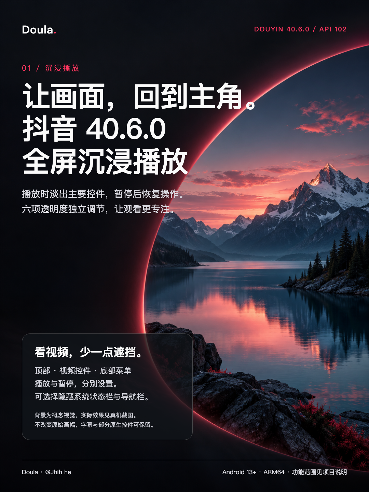
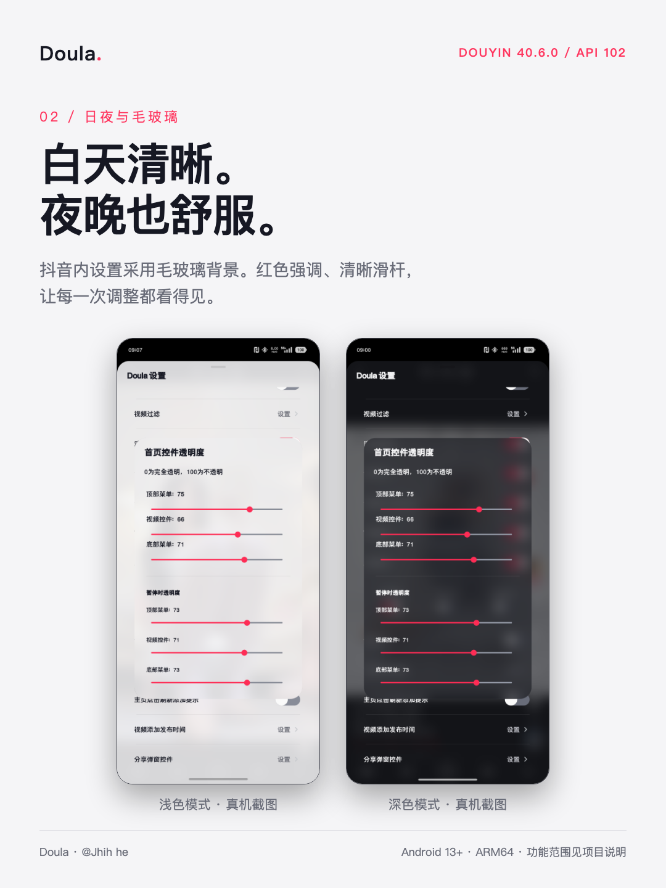
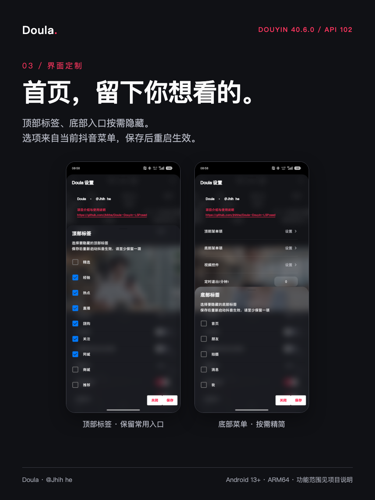
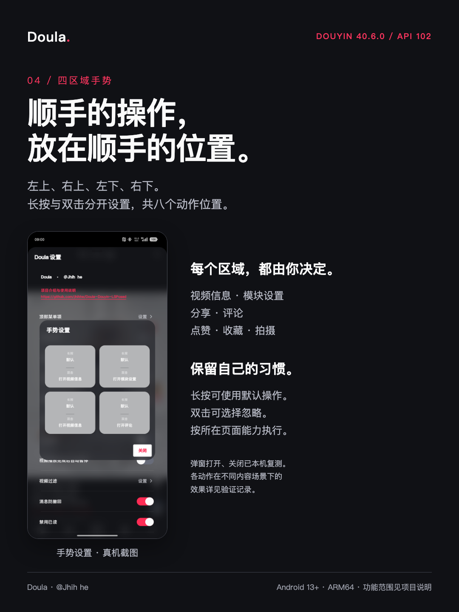
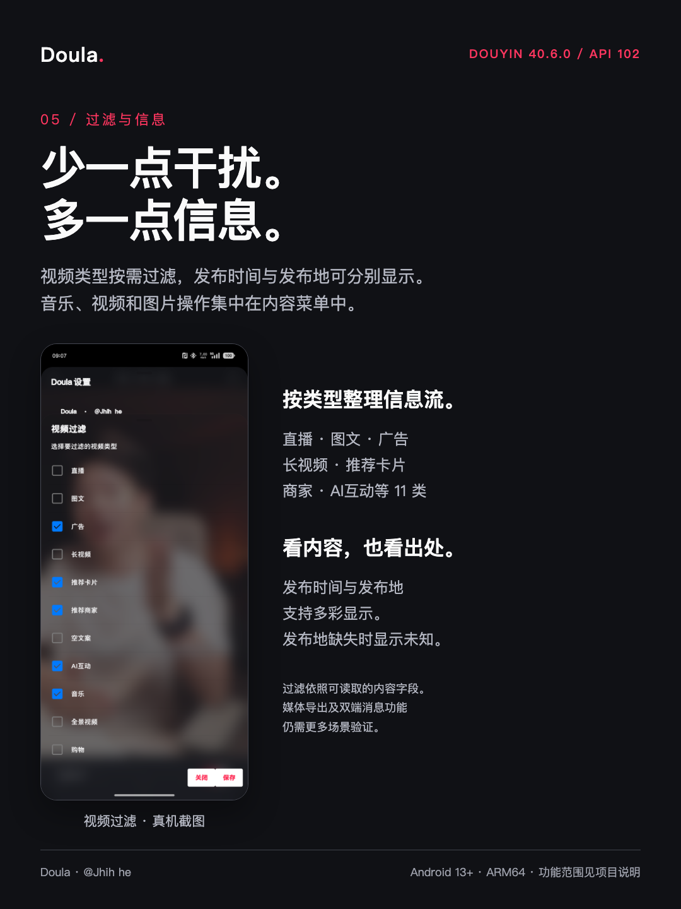

# Doula · 抖音 40.6.0 全屏沉浸播放

让画面，回到主角。播放时淡出主要控件，暂停后恢复操作。

**作者：@Jhih he · LSPosed API 102 · Android 13+ · ARM64**

[正式版下载](https://github.com/Xposed-Modules-Repo/io.github.jhihhe.doula/releases/tag/2026100510-1.0.0-dy40.6.0-api102) · [保留的测试版](https://github.com/Xposed-Modules-Repo/io.github.jhihhe.doula/releases/tag/2026100506-40.6.0-api102-preview.6) · [完整功能](FEATURES.md) · [更新日志](CHANGELOG.md) · [真机截图](GALLERY.md)

## 正式通道与测试通道

| 通道 | 版本 | 用途 |
| --- | --- | --- |
| 正式 | **1.0.0-dy40.6.0-api102**（2026100510） | 本次核心界面、菜单、手势弹窗和沉浸播放修复，建议优先使用。 |
| 测试 | **40.6.0-api102-preview.6**（2026100506） | 原测试包原样保留，供回退与对照。官方包名下手势布局仍有旧类名引用问题，建议使用正式版。 |
| 历史测试 | preview.4 | 原预发行版继续保留在官方 Releases。 |

正式版与测试版使用相同官方包名 `io.github.jhihhe.doula`，可在 LSPosed 的发行版/测试通道中分别查看。一个包名在同一 Android 用户中只能安装一个版本；“保留测试版”指下载和历史发行记录并存。旧包名 `com.android.admin` 的本机测试安装不作为官方仓库发行包。

## 核心体验

- **全屏沉浸播放**：顶部菜单、视频控件、底部菜单各有播放/暂停透明度；从完全显示到完全透明均可调。状态栏和系统导航栏可按需隐藏。
- **界面精简**：顶部与底部标签来自当前抖音菜单，选择隐藏项目，保存后完全重启抖音生效。
- **日夜毛玻璃**：设置和弹窗呈现背景模糊、圆角与红色强调色，滑杆与开关在深浅色模式下更易辨认。
- **四区域手势**：四个区域分别设置双击和长按，保留默认处理，或配置模块设置、视频信息、评论等操作。
- **过滤与信息**：11 类视频类型过滤、文案规则、发布时间与发布地显示。发布地依赖视频实际提供的数据，缺失时不会推测。
- **原有功能入口保留**：消息、评论、媒体保存、播放提醒等完整清单见 [功能详情](FEATURES.md)，验证范围见 [真机记录](VALIDATION.md)。

沉浸播放主要针对首页推荐视频。保留视频原始画幅，不把横屏内容强行拉伸填满屏幕；视频自带字幕、弹幕和部分动态原生控件可能仍然显示。透明度不代表禁用控件点击。搜索详情等页面不承诺具有与首页相同的隐藏范围。

## 宣传图与真实截图

[查看完整截图集](GALLERY.md) · [详细功能宣传文案](MARKETING.md) · [测试环境与边界](VALIDATION.md)

主视觉背景为概念插画；功能宣传图嵌入未经内容重绘的真机截图。信息流中的第三方视频仅用于展示模块效果，内容创作者与本模块无关联。

## 安装与沉浸设置

1. 安装支持现代 API 102 的 LSPosed，并安装正式版 APK。
2. 启用 Doula，作用域选择抖音 `com.ss.android.ugc.aweme`；避免同时启用旧包名模块与其他修改同一区域的模块。
3. 完全停止并重新打开抖音，长按视频，在内容菜单里打开 **Doula 设置**。
4. 打开“首页控件透明度”：播放时三项设为 **0**，暂停时三项设为 **100**。也可用中间数值保留部分控件。
5. 如需隐藏系统栏，开启“隐藏状态栏”“隐藏导航栏”；完全重启抖音后确认效果。
6. 顶部、底部菜单设置中勾选的是“要隐藏”的项目，保存后重启；至少保留一个入口。

本次目标版本为抖音 **40.6.0 / 400601**。其他版本、设备和框架组合尚未逐一验证。双端消息效果需要另一账号配合，当前无双端验证结论。

## 反馈与来源

[问题反馈](https://github.com/jhihhe/Doula-Douyin-LSPosed/issues)。请说明模块版本、抖音版本、LSPosed 版本、复现步骤和相关截图；上传日志前先移除个人信息。

如果体验对你有帮助，欢迎收藏项目、留言反馈使用情况；在支持投币的平台也可自愿支持维护。请把具体问题和使用环境一并留下，方便继续适配。

Doula 基于原“抖+”模块适配，保留上游与第三方版权、许可证和致谢。当前界面、兼容层与发布维护者：**@Jhih he**。本仓库只发布介绍、宣传图、截图、更新日志和签名发行包，不公开模块源码。Doula 与抖音官方无隶属关系。
